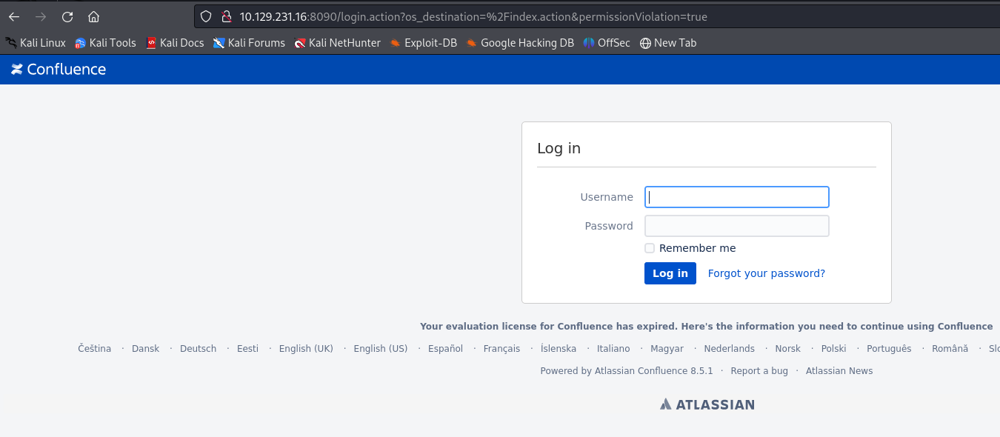
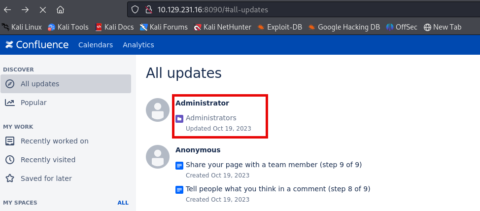
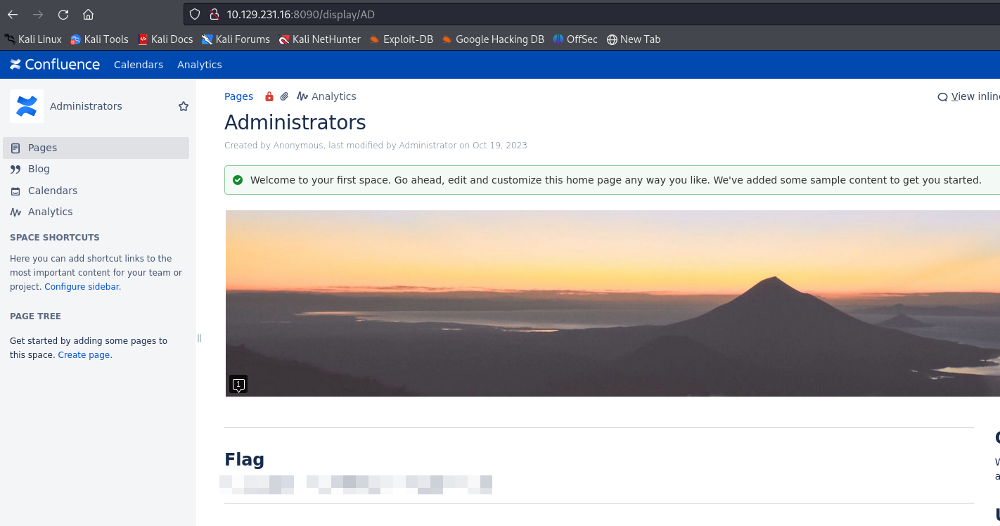

# Root
* scanned the box: `nmap -sC -sV 10.129.231.16`
```
Starting Nmap 7.94SVN ( https://nmap.org ) at 2024-06-12 14:39 EDT
Stats: 0:01:02 elapsed; 0 hosts completed (1 up), 1 undergoing Service Scan
Service scan Timing: About 50.00% done; ETC: 14:40 (0:00:31 remaining)
Nmap scan report for 10.129.231.16
Host is up (0.056s latency).
Not shown: 998 closed tcp ports (conn-refused)
PORT     STATE SERVICE       VERSION
22/tcp   open  ssh           OpenSSH 8.4p1 Debian 5+deb11u2 (protocol 2.0)
| ssh-hostkey: 
|   3072 df:ad:60:d1:65:21:ad:be:c8:75:d8:8c:ec:34:57:72 (RSA)
|   256 8e:b2:88:13:74:d4:66:30:79:38:b7:ea:a7:f8:35:51 (ECDSA)
|_  256 bf:fe:cb:4f:fb:34:fa:5f:d6:8a:b6:43:ba:0e:33:a6 (ED25519)
8090/tcp open  opsmessaging?
Service Info: OS: Linux; CPE: cpe:/o:linux:linux_kernel

Service detection performed. Please report any incorrect results at https://nmap.org/submit/ .
Nmap done: 1 IP address (1 host up) scanned in 100.49 seconds
```
* browsing to port 8090 results in a login page for confluence

* no default creds exist and `administrator:password` did not work
* looked up the version (8.5.1)
	* https://confluence.atlassian.com/security/cve-2023-22522-rce-vulnerability-in-confluence-data-center-and-confluence-server-1319570362.html
		* Dead end!
	* https://confluence.atlassian.com/security/cve-2023-22515-broken-access-control-vulnerability-in-confluence-data-center-and-server-1295682276.html
		* https://www.vicarius.io/vsociety/posts/understanding-the-confluence-vulnerability-cve-2023-22515
* by appending `server-info.action?bootstrapStatusProvider.applicationConfig.setupComplete=false` to the url I was able to reinitiate the setup process

* I was then able to navigate to this `setup/setupadministrator-start.action` and create an account


